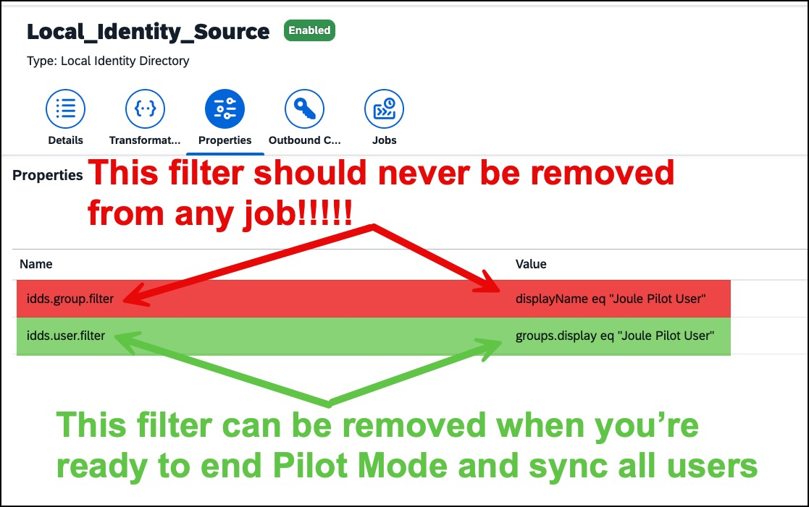

# SAP Cloud Identity Services - IPS Jobs for SAP Concur - Using Joule Pilot User mode

## Description
<!-- Please include SEO-friendly description -->
These are pre-configured provisioning jobs that you can import into Identity Provisioning. They require minimal configuration, based on your specific needs. These are intended for use when Joule Pilot Mode does  need to be used - the transformations include a group section that's required for syncing the Joule Pilot User Group. See [Joule Pilot Mode ↗](https://help.sap.com/docs/joule/integrating-joule/joule-selective-access-pilot-mode-onboarding-overview?version=DEV&state=DRAFT) for more information.

The jobs will first source users from Concur and create them in the local identity directory of your Cloud Identity instance. They will then provision the SAP Global ID back to the corresponding user in Concur. The Global ID is a prerequisite for using Joule and Task Center.

The files should be imported in numerical order. Note that there are PROD and TEST versions of the Concur Source and Concur Target jobs - use the PROD versions if you're working in your Concur production entity (entity ID starts with a "p") and use the TEST versions if you're working in your Concur production sandbox entity (test site - entity ID starts with a "t"). 

After importing both the Concur source and target jobs, there are two properties you will need to update:
1) concur.company.id
2) concur.authorization.code

The values needed for these fields can be obtained by logging into Concur with an admin user and navigating to Administation -> Company -> Authentication Admin and then clicking on Company Request Token. Enter 

> **5bea7d57-6bc5-45ba-b5cf-91f04940fbf2**

in the App ID field and click Submit, and take note of the resulting Company UUID and Company Request Token Values.
Enter the Company UUID value in the concur.company.id property, and enter the Company Request Token Value in the concur.authorization.code value.

The Local Identity Source job includes a property called **idds.user.filter** defaulted to a value of groups.display eq "Joule Pilot User". This will limit only users assigned to the Joule Pilot Group to be synced to Concur. This property can be deleted when you're ready to disable Pilot Mode and need to sync all users.

> ⚠️ **Important:** Even if you have disabled Pilot Mode, DO NOT EVER CHANGE OR REMOVE the property **idds.group.filter** displayName eq "Joule Pilot User" for any job! This property and filter needs to remain in place even if you are not using Joule Pilot Mode or you risk impacting role assignments in Concur. CHANGING OR REMOVING THIS FILTER RISKS IRREVERABLE LOSS OF DATA!

## Requirements
You will need 
1) An SAP Cloud Identity Services tenant and corresponding admin user.
2) An SAP Concur tenant and and corresponding admin user.

## Known Issues
<!-- You may simply state "No known issues. -->
No known issues

## How to obtain support
For complete documentation on these provisioning jobs, refer to the SAP Help portal:
1) [SAP Concur Source System ↗](https://help.sap.com/docs/cloud-identity-services/cloud-identity-services/sap-concur?locale=en-US&version=LATEST)
2) [Local Identity Directory Source System ↗](https://help.sap.com/docs/cloud-identity-services/cloud-identity-services/local-identity-directory?locale=en-US&version=LATEST)
3) [Local Identity Directory Target System ↗](https://help.sap.com/docs/cloud-identity-services/cloud-identity-services/target-local-identity-directory?locale=en-US&version=LATEST)
4) [SAP Concur Target System ↗](https://help.sap.com/docs/cloud-identity-services/cloud-identity-services/target-sap-concur?locale=en-US&version=LATEST)

If you need additional support with provisioning jobs, create a case with SAP Support using the component "BC-IAM-IPS". See [note 1296527 ↗](https://me.sap.com/notes/1296527/E) for additional details about how to create a support case.

## Contributing
This repository is provided "as-is".

## License
Copyright (c) 2026 SAP SE or an SAP affiliate company. All rights reserved. This project is licensed under the Apache Software License, version 2.0 except as noted otherwise in the [LICENSE](../LICENSE) file.
