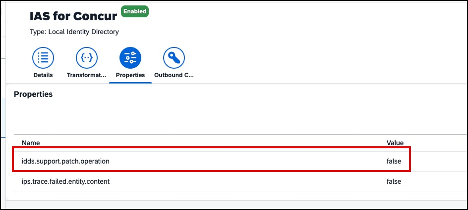
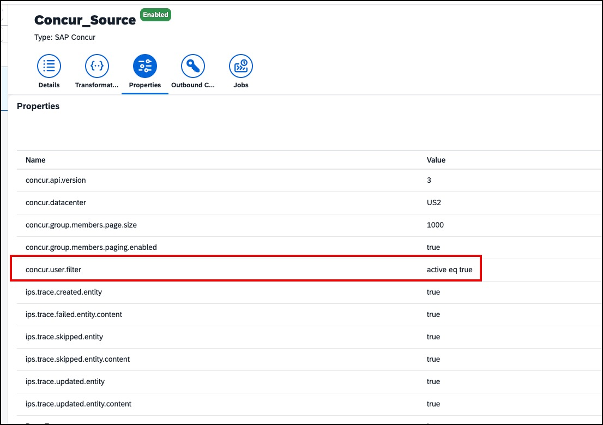

# SAP Cloud Identity Services - IPS Jobs for SAP Concur

[](https://api.reuse.software/info/github.com/sap-samples/concur-joule-ips-jobs)


## Description
These are pre-configured provisioning jobs that you can import into Identity Provisioning. They require minimal configuration, based on your specific needs.
The jobs will first source users from Concur and create them in the local identity directory of your Cloud Identity instance. They will then provision the SAP Global ID back to the corresponding user in Concur. The Global ID is a prerequisite for using Joule and Task Center.

More detailed information for using the jobs can be found in the corresponding directories.

> **Note:** If your IPS jobs were created automatically (e.g. via the setup automation described in the [SAP Help Portal](https://help.sap.com/docs/sap-concur/sap-cloud-identity-services/overview)), the jobs and their properties already exist in your tenant. In that case, use only the **Transformation Only** files found in each job folder — do not import the complete jobs, as doing so would overwrite your existing job configuration.

If your jobs were created automatically, there are two additional property changes to be aware of:

- **Local Identity Directory Target (IAS → Concur) — `idds.support.patch.operation`:** This property is set to `true` by default in automatically-created jobs. It must be changed to `false`. When set to `true`, any run that attempts to update a user's email address will fail with the error: _user:emails in mapping is not allowed for patch update operation_.

  

- **Concur Source — active users only:** Automatically-created Concur source jobs sync both active and inactive users by default. If you want to provision only active users, add the following property to the Concur source job:
  ```
  concur.user.filter = active eq true
  ```
  

- **Troubleshooting — verbose logging:** If you encounter errors during a provisioning run, you can add the following properties to the relevant job to enable more detailed logs:
  | Property | Value |
  |---|---|
  | `ips.trace.created.entity` | `true` |
  | `ips.trace.updated.entity` | `true` |
  | `ips.trace.updated.entity.content` | `true` |
  | `ips.trace.skipped.entity` | `true` |
  | `ips.trace.skipped.entity.content` | `true` |
  | `ips.trace.failed.entity.content` | `true` |

### Joule Pilot Mode
Joule Pilot Mode (selective access) can now be configured directly in the Concur UI. See [Joule Selective Access — Pilot Mode Onboarding](https://help.sap.com/docs/sap-concur-security/sap-concur-solutions-ai-resources/joule-selective-access-pilot-mode-onboarding) for details.

Use the **Joule Pilot Mode** jobs or transformations in this repository **only** if you prefer to continue managing Pilot Mode access (the Joule Pilot User group and user assignments) in Cloud Identity Services rather than through the Concur UI.

## Requirements
You will need 
1) An SAP Cloud Identity Services tenant and corresponding admin user.
2) An SAP Concur tenant and and corresponding admin user.


## Known Issues
No known issues

## How to obtain support
For complete documentation on these provisioning jobs, refer to the SAP Help portal:
1) [SAP Concur Source System ↗](https://help.sap.com/docs/cloud-identity-services/cloud-identity-services/sap-concur?locale=en-US&version=LATEST)
2) [Local Identity Directory Source System ↗](https://help.sap.com/docs/cloud-identity-services/cloud-identity-services/local-identity-directory?locale=en-US&version=LATEST)
3) [Local Identity Directory Target System ↗](https://help.sap.com/docs/cloud-identity-services/cloud-identity-services/target-local-identity-directory?locale=en-US&version=LATEST)
4) [SAP Concur Target System ↗](https://help.sap.com/docs/cloud-identity-services/cloud-identity-services/target-sap-concur?locale=en-US&version=LATEST)

If you need additional support with provisioning jobs, create a case with SAP Support using the component "BC-IAM-IPS". See [note 1296527 ↗](https://me.sap.com/notes/1296527/E) for additional details about how to create a support case.

## Contributing
This repository is provided "as-is".

## License
Copyright (c) 2026 SAP SE or an SAP affiliate company. All rights reserved. This project is licensed under the Apache Software License, version 2.0 except as noted otherwise in the [LICENSE](LICENSE) file.
